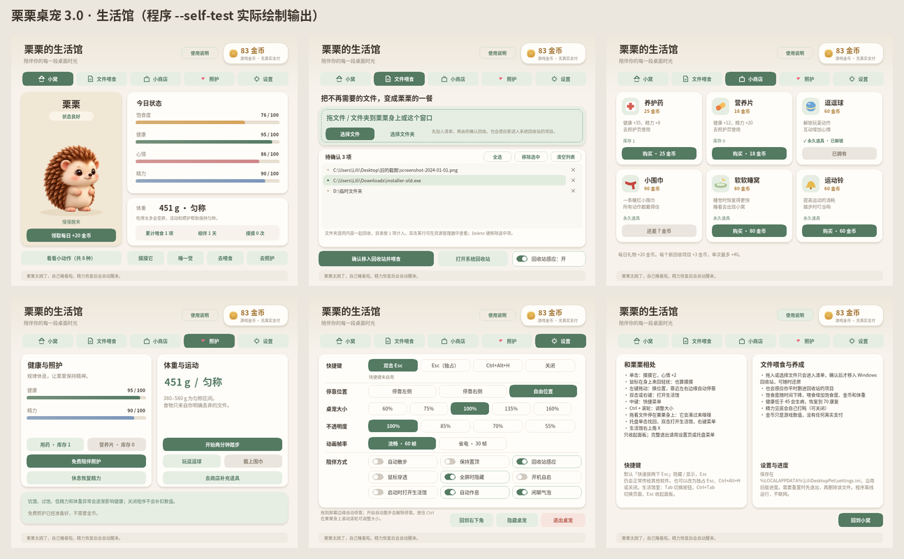

# 栗栗 · 小刺猬桌宠 3.0（重做版）

<p align="center"></p>

一只住在 Windows 桌面上的小刺猬。会散步、伸懒腰、打哈欠、挠脸、打滚、睡觉，能摸摸、能喂食——
喂的是你**确认过**不要的文件（移入 Windows 回收站，随时可还原）。

3.0 在 2.1 的基础上整体重写：**修复了 18 个问题，功能只增不减**。完整列表见 [CHANGELOG.md](CHANGELOG.md)。



> 上面的动图和截图都是程序自己（`--export-anim` / `--self-test`）用真实渲染代码画出来的，不是设计稿。

## 下载与运行

- 直接运行 [`release/栗栗桌宠.exe`](release/)（Windows 10 / 11 x64，单文件，无需安装、无需管理员权限）。
- 升级：3.0 会检测正在运行的旧版，可一键让旧版保存并退出，**养成进度自动沿用**。
- 程序未做数字签名，Windows 可能提示“发布者未知”。
- 详细用法见 [`release/使用说明.txt`](release/使用说明.txt)。

## 主要改进一览

**修复**：全局 Esc 被独占 → 改为不占用按键的「双击 Esc」；生活馆 / 桌宠 CPU 占用高；回收站很大时周期性卡顿；
动作切换时五官重影；拖动后散步被永久关闭；停靠切换时身体瞬移；每次启动弹面板抢焦点；按钮闪烁；身体半透明和边缘噪点；
围巾在多数动作中消失；生病仍能玩球、精力耗尽仍在踏步；多显示器 DPI；存档非原子写入；托盘菜单不显示；气泡长句截断……

**新增**：围巾跟随所有动作、鼠标轻抚也能摸摸、转头看向鼠标、拖文件时凑过来嗅嗅、欢呼等 3 个新动作、自动作息、
闲聊气泡、60% / 160% 大小与 Ctrl + 滚轮缩放、不透明度、鼠标穿透、全屏自动隐藏、开机自启、省电帧率、回到右下角、
喂食清单多选 / 逐项移除 / 在资源管理器中定位、小窝统计（累计喂食、相伴天数、摸摸次数）、使用说明页、生活馆键盘操作……

## 从源码构建

| 环境 | 命令 |
|---|---|
| Linux / macOS 交叉编译（MinGW-w64） | `./build.sh`（先跑单元测试，再输出 `build/LiliDesktopPet.exe`） |
| Windows + MinGW-w64 | 双击 `build-windows.bat` |
| Windows + Visual Studio 2022 | `cmake -S . -B build -A x64` → `cmake --build build --config Release` → `ctest --test-dir build -C Release` |

GitHub Actions（`.github/workflows/build.yml`）每次推送都会：MSVC 构建 + 单元测试 + **在 Windows 上运行 `--self-test`**，以及 MinGW 交叉编译，产物可在 Actions 页面下载。

### 测试

- 可移植单元测试（任何平台）：`tests/test_logic.cpp`（养成规则、路径边界、仅回收保护）、`test_animation.cpp`（19 个动作时间轴、打断衔接、围巾锚点）、
  `test_motion_flow.cpp`（光流插值、多帧形变、包围盒一致性）、`test_blit.cpp`（仿射合成器）。
- exe 内置自检：`LiliDesktopPet.exe --self-test`，在当前目录写出 `self-test.txt`（244 项）以及每一帧、每个动作、六个面板页面的 PNG。不处理任何真实文件。
- `--bench` 输出各阶段耗时；`--export-anim` 导出预览动画帧。

## 目录结构

```
src/            程序源码
  app.*           状态机、养成更新、命令、文件喂食流程
  pet_window.cpp  桌宠窗口：定位、停靠、绘制、鼠标交互
  panel.cpp       生活馆（整窗自绘）
  system.cpp      托盘、快捷键、回收站后台感应、开机自启、全屏检测、OLE 拖放
  sprites.*       帧烘焙、噪点清理、按姿态合成身体
  animation.h     平台无关的动画时间轴（19 个动作）
  motion_flow.h   光流插值与多帧形变
  blit.h          软件仿射合成器
  pet_logic.h     养成规则（与 2.1 数值一致）
  recycle.h       安全回收（只移入回收站，绝不永久删除）
  settings.*      存档（兼容 2.1，原子写入）
assets/         角色图集、位移向量、元数据（沿用 2.1 素材，未修改原图）
tests/          单元测试
tools/          素材元数据 / 位移向量 / 围巾锚点生成脚本，离线预览工具
docs/           素材说明、预览图
release/        可直接运行的 exe 与使用说明
```

## 回收保护（与 2.1 相同）

只接受本机固定磁盘上的普通路径；拒绝整盘、系统 / 程序 / 设置目录、整个用户常用文件夹、桌宠本体及其父文件夹、网络盘、U 盘、
符号链接 / 联接、云占位文件、通配符和超长路径。确认前后都会重新检查；Shell 若准备改为永久删除会直接中止。不提供清空回收站或永久删除功能。
